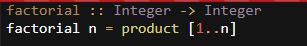
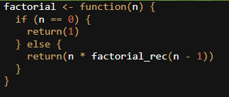

# Análisis: Mejoras mediante el Paradigma Funcional

---

## Introducción

A pesar de que muchas veces se piensa que la única o más óptima opción de desarrollo de código es la iterativa, es importante resaltar el uso del **paradigma funcional** para optimizar su código.

---

## ¿Por qué puede el paradigma funcional ser útil en el cálculo factoria?

El paradigma funcional se puede definir como el uso de funciones matemáticas para resolver problemas a la hora de programar. Este paradigma debe ser capaz de realizar las operaciones, y el sistema debe hacerlas funcionar internamente.

### Algunas ventajas del paradigma funcional

- Inmutabilidad: Crea datos que luego no se pueden cambiar, para asi evitar confusiones o efectos no deseados
- El trato de las funciones: Pueden ser tratadas como argumentos de otras funciones, asignarse a variables, y ser almacenadas en estructuras de datos
- Pureza de funciones: Deben producir siempre el mismo resultado para el mismo dato, permitiendo la descomposición de estas en subproblemas
- Reducción: Reduce y simplifica el cálculo a realizar, generando y aplicando buenas practicas de programacion

## Algunos lenguajes con paradigma funcional

- Haskell
- Miranda
- Mathematica
- R
- Python
- Ruby

## Ejemplos de programacion funcional

- Haskell:  
   
- R:
  

## Conclusiones

El paradigma funcional puede ser util a nivel de eficiencia de codigo, optimizando el paralelismo, la escalabilidad y posibilidad de mejorar el codigo, asi mismo como de la posibilidad de usarse las veces que sea necesario
